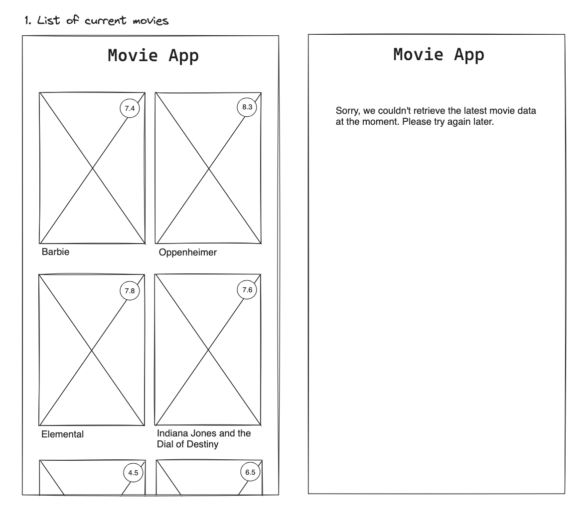

# List of Movies

## Value Proposition

**As a user**  
**I want to see a personalized list of movies**  
**so that I can have an overview of all the movies I have watched** 

## Description

## Acceptance Criteria

- Homepage displays a list of movies
- It is vertically scrollable
- There is a title "Movie App"
- Each list item has:
  - a title
  - an image
  - a rating
- there is an error message displayed if the list is not available

## Tasks

- set up the project and connect with Github called "movie app"
- set up a branch called "starting page"
- Create a header with the title "Movie App"
- Create a collection for movies on MongoDB called "movies"
- Create an array with example movies called "exampleMovies"
- Export the list to the Database
- Create DBConnect
- Create .env.local and insert data for database access
- Create bankend in "DB" folder
- Create a response if there are no entries available
- fetch data in pages/index.js
- Use map() to render a "movieCard" for every db entry
